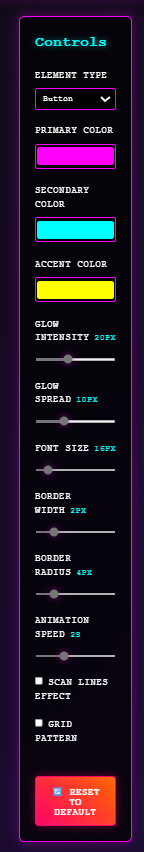

# 🌅 Synthwave CSS Generator

A retro-futuristic neon CSS generator with interactive sliders for creating synthwave-styled components. Built with React + Styled Components.


## ✨ Features

### 🎨 Interactive Controls
- **Color Customization**: Primary, Secondary, and Accent color pickers
- **Glow Effects**: Adjustable intensity and spread sliders
- **Typography**: Font size and styling controls
- **Border Effects**: Width and radius customization
- **Animation**: Speed control for dynamic effects
- **Special Effects**: Scan lines and grid pattern toggles
- **Element Types**: Preview Button, Text, Card, and Input components

### 🔄 Reset Functionality
- **One-Click Reset**: Instantly restore all settings to default values
- **Synthwave Styled**: Reset button with neon glow effects and hover animations

### 💻 Code Generation
- **CSS Output**: Clean, production-ready CSS code
- **Styled Components**: React styled-components code
- **Copy to Clipboard**: One-click code copying
- **Tabbed Interface**: Easy switching between output formats

### 🎭 Synthwave Aesthetic
- **Neon Colors**: Hot pink, cyan, and yellow color palette
- **Retro Typography**: Courier New monospace font
- **Glow Effects**: Dynamic box-shadows and text-shadows
- **Animations**: Pulsing effects and smooth transitions
- **Dark Theme**: Deep space gradient backgrounds
- **Scan Lines**: Classic CRT monitor effects
- **Grid Patterns**: Tron-style background elements

## 🚀 Live Demo

Experience the generator live: [Synthwave CSS Generator](https://synthwavecssgen.netlify.app)

## 📸 Screenshots

### Main Interface


### Interactive Controls


### Code Output


### Reset Functionality


## 🛠️ Technology Stack

- **React 19** - Modern React with hooks
- **Vite** - Fast development and build tool
- **Styled Components** - CSS-in-JS styling
- **JavaScript** - ES6+ features
- **CSS3** - Advanced animations and effects

## 📦 Installation

1. **Clone the repository**
   ```bash
   git clone https://github.com/risterz/synthwave-css-generator.git
   cd synthwave-css-generator
   ```

2. **Install dependencies**
   ```bash
   npm install
   ```

3. **Start development server**
   ```bash
   npm run dev
   ```

4. **Open in browser**
   ```
   http://localhost:5173
   ```

## 🎯 Usage

### Basic Usage
1. **Adjust Controls**: Use sliders and color pickers to customize your style
2. **Preview Live**: See changes instantly in the preview area
3. **Generate Code**: Switch between CSS and Styled Components tabs
4. **Copy Code**: Click the copy button to get your generated styles
5. **Reset**: Use the reset button to return to default settings

### Element Types
- **Button**: Interactive button with hover effects
- **Text**: Glowing text with synthwave styling
- **Card**: Container component with backdrop blur
- **Input**: Form input with neon border effects

### Customization Options
- **Colors**: Primary (#ff00ff), Secondary (#00ffff), Accent (#ffff00)
- **Glow**: Intensity (0-50px), Spread (0-30px)
- **Typography**: Font size (12-48px)
- **Border**: Width (0-10px), Radius (0-20px)
- **Animation**: Speed (0.5-5s)
- **Effects**: Scan lines, Grid patterns

## 🎨 Generated CSS Example

```css
.synthwave-button {
  font-family: 'Courier New', monospace;
  font-size: 16px;
  background: linear-gradient(45deg, #ff00ff, #00ffff);
  border: 2px solid #ff00ff;
  border-radius: 4px;
  color: #fff;
  padding: 1rem 2rem;
  box-shadow: 
    0 0 20px #ff00ff,
    inset 0 0 10px rgba(255, 255, 255, 0.1);
  animation: synthwave-pulse 2s ease-in-out infinite alternate;
}

.synthwave-button:hover {
  transform: translateY(-2px);
  box-shadow: 
    0 0 30px #ff00ff,
    0 5px 15px rgba(0, 0, 0, 0.3);
}

@keyframes synthwave-pulse {
  from { box-shadow: 0 0 20px #ff00ff; }
  to { box-shadow: 0 0 24px #ff00ff; }
}
```

## 🔧 Development

### Project Structure
```
synthwave-css-generator/
├── src/
│   ├── components/
│   │   ├── SynthwaveGenerator.jsx
│   │   ├── ControlPanel.jsx
│   │   ├── PreviewArea.jsx
│   │   └── CodeOutput.jsx
│   ├── App.jsx
│   ├── main.jsx
│   └── index.css
├── public/
├── screenshots/
└── README.md
```

### Available Scripts
- `npm run dev` - Start development server
- `npm run build` - Build for production
- `npm run preview` - Preview production build
- `npm run lint` - Run ESLint

## 🤝 Contributing

1. Fork the repository
2. Create your feature branch (`git checkout -b feature/amazing-feature`)
3. Commit your changes (`git commit -m 'Add amazing feature'`)
4. Push to the branch (`git push origin feature/amazing-feature`)
5. Open a Pull Request

## 📄 License

This project is licensed under the MIT License - see the [LICENSE](LICENSE) file for details.

## 🙏 Acknowledgments

- Inspired by the synthwave music and aesthetic movement
- Built with modern React and CSS-in-JS techniques
- Designed for developers who love retro-futuristic styling

## 🔗 Links

- [Live Demo](https://synthwavecssgen.netlify.app)
- [GitHub Repository](https://github.com/risterz/synthwave-css-generator)
- [Issues](https://github.com/risterz/synthwave-css-generator/issues)

---

Made with 💜 and ⚡ by [risterz](https://github.com/risterz)

*Embrace the neon future* 🌆